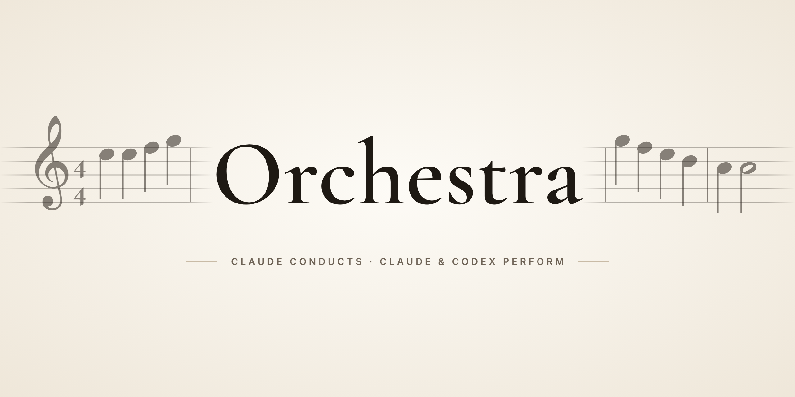
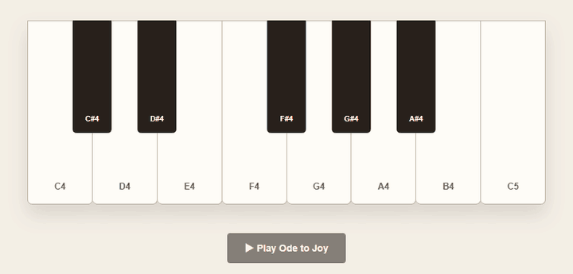

<p align="center">
  
</p>

<p align="center"><b>한국어</b> · <a href="README.en.md">English</a></p>

<p align="center"><a href="https://github.com/lsy041015/orchestra/actions/workflows/tests.yml"></a></p>

# 오케스트라 (Orchestra)

> **지휘는 비싼 모델이, 연주는 알맞은 모델이.**
> Claude Code 메인 세션이 계획과 리뷰를 맡고, 범위가 정해진 구현은 난이도에 맞춰 고른
> **Claude 서브에이전트** 또는 **Codex CLI(GPT)** 워커에게 맡기는 스킬 플러그인입니다.

[Jesse Vincent의 Superpowers](https://github.com/obra/superpowers) 6.4.1을 기반으로 한 개인 포크입니다.
공식 OpenAI·Anthropic·Superpowers 배포판이 아닙니다. Claude·Codex 같은 이름은 연동 대상을 가리킬 때만 쓰며,
각 상표는 해당 소유자의 것입니다.

> **상태: 실험판 (v0.3.1).** 변경 내역은 [CHANGELOG](CHANGELOG.md)에 있습니다. 작성자의 Windows 환경에서 실제 작업에 쓰며 검증하고 있습니다.
> 테스트는 GitHub Actions에서 Ubuntu·macOS·Windows로 돌립니다. macOS·Linux에서의 오케스트레이터 실사용과 사용량 절감 측정은 아직입니다. 아래 [검증 현황과 한계](#17-검증-현황과-한계)를 먼저 읽어 주세요.

---

## 목차

1. [왜 만들었나](#1-왜-만들었나)
2. [핵심 아이디어: 지휘자와 연주자](#2-핵심-아이디어-지휘자와-연주자)
3. [설계 원칙](#3-설계-원칙)
4. [전체 흐름](#4-전체-흐름)
5. [난이도 티어](#5-난이도-티어)
6. [모델 라우팅 설정](#6-모델-라우팅-설정)
7. [Claude 워커](#7-claude-워커)
8. [Codex 워커와 codex-worker.mjs](#8-codex-워커와-codex-workermjs)
9. [리뷰와 수정 루프](#9-리뷰와-수정-루프)
10. [Ledger와 복구](#10-ledger와-복구)
11. [TUI에서 보고 조작하기](#11-tui에서-보고-조작하기)
12. [설치](#12-설치)
13. [빠른 시작](#13-빠른-시작)
14. [포함된 스킬](#14-포함된-스킬)
15. [저장소 구조](#15-저장소-구조)
16. [안전장치](#16-안전장치)
17. [검증 현황과 한계](#17-검증-현황과-한계)
18. [원하는 방향 (로드맵)](#18-원하는-방향-로드맵)
19. [기여와 이슈](#19-기여와-이슈)
20. [출처와 라이선스](#20-출처와-라이선스)

---

## 1. 왜 만들었나

요즘 개발자 중에는 **Claude와 ChatGPT(Codex)를 동시에 구독**하는 사람이 많습니다.
그런데 두 구독을 같이 쓰면 이런 일이 생깁니다.

- **한쪽 한도만 먼저 바닥납니다.** Claude Code로 모든 작업을 하면 Claude 주간 한도는 금방 차는데,
  Codex 한도는 남아서 버려집니다. 반대도 마찬가지입니다.
- **비싼 모델이 단순 작업까지 합니다.** 상수 정리, 반복 편집, 테스트 추가 같은 작업에도
  가장 비싼 모델의 사고력과 한도를 씁니다.
- **서브에이전트가 폭주합니다.** 에이전트가 에이전트를 부르고, 리뷰어가 또 리뷰어를 부르면서
  누가 무엇을 바꿨는지 추적이 안 되고 사용량만 늘어납니다.
- **위임한 결과를 아무도 제대로 보지 않습니다.** "완료했습니다"라는 요약만 믿고 넘어가면
  테스트가 실제로 돌았는지, 허용하지 않은 파일을 건드렸는지 알 수 없습니다.
- **고치기 루프가 끝나지 않습니다.** 같은 원인으로 실패하는 수정을 계속 다시 시킵니다.
- **워커 컨텍스트가 비대해집니다.** 한 워커에게 계속 일을 몰아주면 컨텍스트가 수십만 토큰까지
  불어나고, 한 턴이 눈에 띄게 느려집니다.

오케스트라는 이 문제들을 **운영 규칙과 작은 스크립트**로 풉니다. 목표는 세 가지입니다.

1. **판단은 사용자가 고른 메인 모델이 독점한다.** 계획, 리뷰, 진단, 통합은 메인 세션만 합니다.
2. **구현은 작업 난이도에 맞는 모델에게 맡긴다.** 쉬운 일은 싸고 빠른 모델, 어려운 일은 강한 모델.
   Claude든 Codex든 사용자가 티어별로 고릅니다.
3. **위임 결과는 반드시 증거로 확인한다.** 실제 diff, 실제 테스트 출력, 허용 파일 범위를 봅니다.

---

## 2. 핵심 아이디어: 지휘자와 연주자

| 역할 | 누가 | 하는 일 | 하지 않는 일 |
|---|---|---|---|
| **지휘자** | Claude Code 메인 세션 (사용자가 고른 모델·추론 수준 그대로) | 요구사항 정리, 계획, 작업 분할, 난이도 판정, 워커 배정, 리뷰, 재리뷰, 진단, 통합, 최종 검증 | 큰 구현을 직접 떠안기 |
| **연주자** | 워커 1명 = 작업 1개. Claude 서브에이전트 또는 Codex CLI 프로세스 | 브리프에 적힌 파일만 수정, TDD, 테스트 실행, 짧은 리포트 작성 | 범위 확장, 새 설계, 다른 에이전트 호출, 자기 결과 승인 |
| **악보** | 계획 파일 + 작업별 브리프 | 목표, 허용 파일, 인터페이스, 인수 조건, 테스트 명령 | — |
| **연주 기록** | ledger (`progress.md`) | 라우팅, 작업별 완료 기록, Codex thread id, 결정(`Ruling:`) | — |

메인 세션은 "지휘"에 집중하고, 워커는 "연주"만 합니다. Claude 워커는 `disallowedTools: Agent`로 하위 에이전트를
만들 수 없고, Codex 워커는 브리프 규칙으로 금지합니다(Codex 0.156은 `features.multi_agent=false`로도 에이전트 도구가 꺼지지 않음을 확인).

---

## 3. 설계 원칙

### 3.1 판단은 한 곳에서
- 계획, 리뷰, 재리뷰, 진단, 통합은 **메인 세션만** 합니다.
- 별도 리뷰 에이전트, 계획 에이전트, 진단 에이전트를 만들지 않습니다.
  "독립 리뷰"를 흉내 내느라 사용량을 두 배로 쓰지 않습니다.
- 메인 세션의 모델과 추론 수준은 **플러그인이 바꾸지 않습니다.** 사용자가 고른 그대로 씁니다.

### 3.2 워커는 구현만, 좁게
- 워커는 **허용 파일 목록 안에서만** 수정합니다.
- 새 아키텍처, 새 의존성, 범위 확장은 금지입니다. 결정이 빠져 있으면 `NEEDS_DECISION`으로 돌려보냅니다.
- Claude 워커는 에이전트 정의에서 `disallowedTools: Agent`로 **하위 에이전트 생성이 차단**됩니다.
- Codex 워커는 브리프 끝에 붙는 "Codex 규칙"(git commit·push·reset·checkout 금지, 허용 파일만 수정,
  장시간 서버 방치 금지, 리포트 40줄 이하)을 따르고, **실행 후 스크립트가 실제 변경 파일을 검사**합니다.
  샌드박스가 `.git`을 읽기 전용으로 두므로 Codex 워커는 커밋할 수 없고, 커밋은 리뷰 후 메인 세션이 합니다.

### 3.3 브리프는 작고 완결되게
- 워커에게는 이전 대화 기록을 넘기지 않습니다. 목표, 허용 파일, 확정된 인터페이스, 인수 조건,
  테스트 명령, 리포트 경로만 담긴 **작업별 브리프**를 줍니다.
- 브리프는 `task-brief` 스크립트가 계획에서 해당 작업만 잘라 만듭니다. 계획 전체를 통째로 주지 않습니다.

### 3.4 증거 기반 리뷰
- 워커의 "DONE"은 증거가 아닙니다. 메인 세션은 **실제 diff**(커밋, 스테이징, 미스테이징, 새 파일 모두)와
  **실제 테스트 출력**을 봅니다.
- Codex 워커의 경우 `Scope:` 줄로 허용 목록 밖 수정 여부를 기계적으로 확인합니다.

### 3.5 끝나는 수정 루프
- 리뷰에서 나온 구체적 지적만 같은 워커에게 다시 보냅니다.
- **같은 원인으로 수정이 두 번 실패하면 멈춥니다.** 메인 세션이 `Ruling:`(결정 기록)을 남기고
  계획을 바꾸거나 직접 고칩니다. 더 비싼 모델로 무작정 재시도하지 않습니다.

### 3.6 사용자 결정권
- 어떤 티어에 어떤 모델을 쓸지는 **사용자가 정합니다.** 설정 파일로 기본값을 두거나, 매번 고릅니다.
- 제품 방향, 게임 스토리, 디자인 취향처럼 사용자의 판단이 필요한 부분은 계획 전에 묻습니다.
- 푸시, 삭제, 공개처럼 되돌리기 어려운 행동은 확인을 받습니다.

### 3.7 실제 운영에서 나온 속도 규칙
18시간짜리 실제 작업에서 병목은 도구가 아니라 **모델의 생각과 출력량**이었습니다. 그래서 브리프에 다음을 요구합니다.
- 워커 리포트는 **40줄 이하**, 수정 라운드 추가분은 **20줄 이하**.
- 코드 주석은 자명하지 않은 "왜"만 1–2줄. 계획이나 작업 번호를 주석에 인용하지 않습니다.
- RED/GREEN 증거는 TDD를 적용한 작업에만 요구합니다.
- 워커 컨텍스트가 커지면 턴이 느려집니다(실측: 56k → 550k 토큰, 턴당 7.5초 → 13초 이상).
  작업은 워커 하나가 감당할 크기로 쪼갭니다. 워커 교체는 사용자가 지시할 때만(`Task N을 <모델>로 바꿔`) 새 브리프로 합니다.

---

## 4. 전체 흐름

```text
 사용자 요청
    │
    ▼
 ① 방향 확인 ── 필요한 결정(목표, 제품 방향, 공개 범위 등)을 먼저 묻는다
    │
    ▼
 ② 계획 작성 ── orchestra:writing-plans
    │            계획 파일: 목표 / 전역 제약 / 인터페이스 / Task N / 검증 / 리스크
    ▼
 ③ 난이도 표 ── | # | 작업 | 티어 | 파일 |   (orchestra:orchestrator)
    │
    ▼
 ④ 모델 선택 ── ~/.claude/orchestra.json + <project>/.orchestra.json 병합
    │            빠진 티어만 AskUserQuestion으로 질문
    ▼
 ⑤ 배정 ────── Claude 워커: Agent(orchestra:implementer[-medium], model=...)
    │            Codex 워커: node codex-worker.mjs ... (백그라운드 Bash)
    │            파일이 겹치지 않는 작업은 병렬
    ▼
 ⑥ 리뷰 ────── 실제 diff + 테스트 출력 + Scope 검사
    │     ╲
    │      ╲ 지적 있음 → ⑦ 수정 루프 (같은 워커 / Codex는 --resume <thread>)
    │       ╲           같은 원인 2회 실패 → Ruling: 후 재계획 또는 직접 수정
    ▼
 ⑧ ledger 기록 ─ "Task N: complete (범위, 리뷰 결과, 테스트 → 결과)"
    │
    ▼
 ⑨ 최종 리뷰·검증 ─ 전체 변경 묶음 리뷰, verification-before-completion
    │
    ▼
 ⑩ 통합 ────── 커밋 / 브랜치 정리 / 푸시(사용자 확인 후)
```

---

## 5. 난이도 티어

메인 세션은 계획의 각 작업에 티어를 붙여 한 장의 표로 보여줍니다.

| 티어 | 기준 | 예시 |
|---|---|---|
| **Easy** | 기계적, 파일 1개, 새 동작 없음 | 상수 정리, 이름 바꾸기, 문서 수치 갱신 |
| **Medium** | 테스트가 딸린 일반 기능이나 버그 수정 | 새 API 필드 추가, 입력 검증 |
| **Hard** | 여러 파일, 계획 안의 새 구조, 까다로운 로직 | 파서, 동시성, 스크립트와 테스트 세트 |
| **Hard (UI)** | 시각적 결과에 대한 판단이 필요한 작업 | 인벤토리 화면, 레이아웃 |

파일 하나짜리 수정이나 단순 조회는 표에 올리지 않고 메인 세션이 바로 처리합니다. 워커를 띄우는 비용이 더 크기 때문입니다.

예시:

```text
| # | 작업                              | 티어      | 파일                                   |
|---|-----------------------------------|-----------|----------------------------------------|
| 1 | codex-worker.mjs와 테스트         | Hard      | scripts/codex-worker.mjs, tests/...    |
| 2 | 스킬을 플러그인으로 이동          | Medium    | skills/orchestrator/SKILL.md, agents/… |
| 3 | README와 매니페스트               | Easy      | README.md, .claude-plugin/*.json       |
```

---

## 6. 모델 라우팅 설정

### 6.1 설정 파일 위치와 병합
| 위치 | 용도 |
|---|---|
| `~/.claude/orchestra.json` | 사용자 기본값. 모든 프로젝트에 적용 |
| `<project>/.orchestra.json` | 프로젝트별 덮어쓰기. 저장소에 커밋해 팀과 공유 가능 |

- `routing`은 **키 단위로 병합**하고 프로젝트 값이 이깁니다.
- `options`는 프로젝트에 있으면 **통째로 대체**하고, 없으면 사용자 값을 씁니다.
- 두 파일 모두 없으면 기본 4개 선택지로 질문합니다.

### 6.2 스키마

```json
{
  "routing": {
    "easy":   "codex gpt-6-luna/medium",
    "medium": "claude sonnet/high",
    "hard":   "claude opus/high",
    "ui":     "claude opus/high"
  },
  "options": [
    "codex gpt-6-luna/medium",
    "codex gpt-6-luna/high",
    "claude sonnet/high",
    "claude opus/high"
  ]
}
```

- 값 형식은 `<codex|claude> <model>/<effort>` 입니다.
- **Codex effort**: `none`, `minimal`, `low`, `medium`, `high`, `xhigh`, `max`, `ultra`.
  모델마다 지원 범위가 다릅니다. 예를 들어 `gpt-6-luna`는 `minimal`을 거부하고, 이때 워커는
  `Status: BLOCKED`와 Codex의 오류 문장을 그대로 돌려줍니다(Codex CLI 0.156.1에서 확인).
- **Claude effort**: `high` → `orchestra:implementer`, `medium` → `orchestra:implementer-medium`.
  Claude Code는 호출마다 effort를 바꿀 수 없고 에이전트 정의에서만 정해지므로, 다른 effort가 필요하면
  `agents/`에 에이전트 파일을 하나 더 만들어야 합니다.
- `ui` 키는 UI 작업을 따로 라우팅하고 싶을 때만 씁니다. 없으면 UI 작업도 `hard`를 따릅니다.

### 6.3 질문을 건너뛰는 조건
작업 표에 나온 **모든 티어에 routing 값이 있으면** 질문 없이 매핑을 한 줄로 보여주고 바로 배정합니다.
값이 없는 티어만 `AskUserQuestion`으로 묻습니다. 사용자는 "Other"로 목록에 없는 모델도 입력할 수 있습니다.
최종 매핑은 ledger에 `Routing: Easy=..., Medium=..., Hard=...` 형태로 남습니다.

### 6.4 작업 단위 덮어쓰기
대화 중 언제든 "Task 3은 claude opus로 바꿔"처럼 말하면 그 작업만 다른 모델로 배정합니다.
진행 중인 워커는 끝내거나 멈춘 뒤 새 브리프로 다시 배정합니다.

---

## 7. Claude 워커

```text
Agent(
  subagent_type = "orchestra:implementer",      # effort high
  model         = "sonnet" | "opus" | "haiku",
  description   = "[Claude sonnet/high] Task 2: 입력 검증",
  prompt        = <작업 브리프 전체>
)
```

- `orchestra:implementer` — `sonnet` 별칭(새 Sonnet이 나오면 따라감) / `high` 기본, `model`로 교체 가능.
- `orchestra:implementer-medium` — 같은 계약, effort `medium`. 단순하고 기계적인 작업용.
- 워커는 브리프를 읽고, 영향받는 소스를 확인하고, TDD로 구현하고, 자기 diff를 점검한 뒤
  리포트 파일을 쓰고 아래 상태 블록만 돌려줍니다.

```text
Status: DONE | BLOCKED | NEEDS_DECISION
Changed files: <paths>
Tests: <commands, exit codes, relevant results>
Unresolved: <none or concrete issue>
Report: <report path>
```

- 수정 라운드는 `SendMessage`로 **같은 워커**에게 보냅니다. 워커는 리포트에 수정 증거를 덧붙이고 같은 형식으로 답합니다.

---

## 8. Codex 워커와 codex-worker.mjs

Codex 워커는 별도 에이전트 계층 없이, 메인 세션이 **백그라운드 Bash**로
[`skills/orchestrator/scripts/codex-worker.mjs`](skills/orchestrator/scripts/codex-worker.mjs)를 실행합니다.
이 스크립트가 `codex exec`를 직접 부르므로 **Codex CLI만 있으면 됩니다.** 다른 플러그인의 내부 캐시 경로에 기대지 않습니다.

### 8.1 사용법

```text
node "<orchestrator 스킬 폴더>/scripts/codex-worker.mjs" \
  --model gpt-6-luna --effort high \
  --cwd "<프로젝트 경로>" \
  --brief "<ledger>/task-3-codex-prompt.md" \
  --allowed "src/retry.ts,test/retry.test.ts" \
  [--resume <thread_id>]
```

| 인자 | 필수 | 검증 |
|---|---|---|
| `--model` | ✔ | `^[A-Za-z0-9._-]+$` |
| `--effort` | ✔ | none·minimal·low·medium·high·xhigh·max·ultra 중 하나 |
| `--cwd` | ✔ | 존재하는 디렉터리. 보통 저장소 루트. `--brief`가 이 안에 있어야 함(Codex 샌드박스는 `--cwd` 밖에 리포트를 쓰지 못함) |
| `--brief` | ✔ | 존재하는 파일. 내용은 **stdin**으로 Codex에 전달 |
| `--allowed` | ✔ | 쉼표 구분, cwd 기준 상대 경로. `/`로 끝나면 그 폴더 전체 허용(`test/fixtures/`). 비어 있으면 거부 |
| `--resume` | | `^[A-Za-z0-9-]+$` (Codex thread id) |

검증에 실패하면 Codex를 실행하지 않고 **exit 2**로 끝납니다.

### 8.2 실제로 실행되는 명령
- 새 작업: `codex exec --json -m <model> -c model_reasoning_effort=<effort> -s workspace-write --skip-git-repo-check -`
- 재개: `codex exec resume <thread_id> --json -m <model> -c model_reasoning_effort=<effort> -c sandbox_mode=workspace-write --skip-git-repo-check -`
- 샌드박스는 항상 `workspace-write`입니다. `--cwd` 밖 쓰기와 `.git` 쓰기는 Codex 샌드박스가 막습니다(Windows 실측). 그래서 Codex 워커는 커밋할 수 없습니다. Linux(Codex 0.156.1)에서도 `.git`과 홈 디렉터리 쓰기는 막히지만 `/tmp`는 쓸 수 있습니다.
- 네트워크는 기본 차단입니다(루프백 소켓 포함). 테스트에 소켓이나 다운로드가 필요할 때만(ROS 2/DDS, localhost 서버, 패키지 설치) 명령 앞에 `ORCHESTRA_CODEX_NETWORK=1`을 붙이면 `-c sandbox_workspace_write.network_access=true`가 추가됩니다(Linux 실측).

### 8.3 출력

```text
<Codex의 마지막 agent_message 그대로 — 보통 상태 블록>
Codex thread: <thread_id>
Scope: ok | outside allowed: a.txt, b.txt | unchecked (<이유>)
```

- 성공: exit 0.
- 실패(Codex 종료 코드 ≠ 0, `turn.failed` 이벤트, 응답 메시지 없음, 응답에 `Status:` 줄 없음): 첫 부분이
  `Status: BLOCKED` + `Unresolved: <오류 또는 stderr 마지막 20줄>`로 바뀌고 exit 1.
  `error` 이벤트만으로는 실패로 보지 않습니다. Codex는 복구한 스트림 재시도도 `error`로 알립니다.
  API 거부는 JSON 덩어리 대신 한 줄 문장으로 보여줍니다. 예:
  `Unresolved: The 'gpt-x' model is not supported when using Codex with a ChatGPT account.`
- `Scope: outside allowed`는 exit 0을 유지합니다. **판단은 메인 세션의 몫**이고, 리뷰 지적으로 처리합니다.

### 8.4 범위 검사는 어떻게 하나
1. 실행 전 `git status --porcelain=v1 -z -uall`로 변경·신규 파일 목록을 얻고 각 파일의 SHA-1을 기록합니다.
2. 실행 후 같은 방식으로 다시 기록합니다.
3. 해시가 달라졌거나 한쪽에만 있는 경로 = "바뀐 파일". 여기서 `--allowed`를 뺀 것이 `outside`입니다.
- 경로는 저장소 루트 기준으로 표시합니다. `--cwd`가 `pkg/`이고 `--allowed a.txt`면 `pkg/a.txt`가 허용되고,
  위반은 `outside allowed: pkg/extra.txt`처럼 나옵니다.
- 실행 **전부터** 수정돼 있던 파일은 내용이 그대로면 잡히지 않습니다. 사용자의 기존 작업을 워커 탓으로 돌리지 않습니다.
- 이름 변경 항목은 새 경로 기준으로 봅니다. 서브모듈처럼 폴더로 보이는 항목도 실행을 멈추지 않습니다.
- `.gitignore`된 파일은 검사 대상이 아닙니다. 그래서 ledger(`.orchestra/sdd/…`, 자동으로 무시됨)에 쓰는 리포트는 범위 위반이 아닙니다.
- git이 실패하면(저장소 아님, 소유자가 달라 git이 거부 등) `Scope: unchecked (git: <오류>)`, 실행 후 git이 실패하면
  `unchecked (git status failed after the run: <오류>)`로 표시합니다. 이때 메인 세션이 `git status`와 diff를 직접 확인합니다.
  Windows에서는 Codex 샌드박스가 만든 파일의 소유자가 `CodexSandboxOffline`이라 이런 거부가 생길 수 있습니다.

### 8.5 thread id로 재개
Codex는 작업마다 thread id를 남깁니다. 수정 라운드에서는 `--resume <thread_id>`로 **그 작업의 대화를 정확히 이어갑니다.**
"가장 최근 세션"을 추측하지 않으므로 **같은 디렉터리에서 Codex 워커 여러 개를 병렬로** 돌려도 대화가 섞이지 않습니다.
재개할 때 `--effort`를 바꿀 수 있습니다(예: 첫 실행 low → 수정 라운드 medium, 실측 확인).

단, 범위 검사는 체크아웃 전체를 비교하므로, 같은 체크아웃에서 동시에 도는 다른 워커가 바꾼 파일도
`Scope: outside allowed`에 나옵니다. 오케스트레이터는 **동시에 도는 다른 워커의 허용 목록에 있는 파일만** 무시하고
나머지는 리뷰 지적으로 처리합니다. 완전히 분리하려면 워커마다 worktree를 따로 쓰세요.

### 8.6 운영체제별 처리
- 경로는 인자로 넘기지 않고 `cwd` 옵션과 stdin으로 전달합니다. 공백이 들어간 경로도 안전합니다.
- Windows에서는 `codex`가 `.cmd` 셔임이라 셸을 거쳐야 실행됩니다. 모든 인자가 검증되고 공백이 없으므로 한 줄 명령으로 합쳐 실행합니다.
- Windows는 PATH보다 현재 폴더를 먼저 찾으므로, 프로젝트 안의 `codex.cmd`·`git.exe`가 진짜 도구 대신 실행되지 않게
  `NoDefaultCurrentDirectoryInExePath`를 켭니다(Claude Code 밖 터미널에서 실행할 때도 안전).
- `cygpath`, `sort -V` 같은 Git Bash·GNU 전용 도구를 쓰지 않습니다.

### 8.7 Codex 브리프
메인 세션은 `orchestra:subagent-driven-development/implementer-prompt.md`를 채운 뒤 아래 규칙을 덧붙여
`<ledger>/task-N-codex-prompt.md`로 저장합니다.

```text
Never run git commit, push, reset or checkout: the sandbox keeps .git
read-only, and the main session commits after review. Edit only allowed
files. Never leave long-running servers or editors running. Keep the report
at [REPORT_FILE] to 40 lines or fewer. Return exactly the brief's status
block.
```

---

## 9. 리뷰와 수정 루프

1. 워커가 `DONE`을 돌려주면 메인 세션이 **실제 변경 전체**를 봅니다: 커밋 범위(`review-package`), `git diff --cached`, `git diff`, 새 파일.
2. 체크 항목: 인수 조건 충족, 범위 밖 동작 없음, 호출 경로·오류 처리·보안·접근성 안전, 테스트가 실제 동작을 검증하는지, 보고된 명령과 출력이 진짜인지, 더 단순한 기존 경로를 불필요하게 대체하지 않았는지.
3. Codex 워커는 추가로 **떠 있는 프로세스**와 `Scope:` 결과를 확인합니다.
4. Critical/Important 지적이 있으면 수정 루프로 갑니다.
   - Claude 워커: `SendMessage`로 같은 워커에게.
   - Codex 워커: 지적을 `task-N-codex-fix-K.md`로 쓰고, 같은 `--model/--effort/--cwd/--allowed`에 `--resume <thread>`를 붙여 재실행.
5. 메인 세션은 **지적 사항과 수정 diff만** 다시 봅니다. 건드리지 않은 코드를 처음부터 다시 리뷰하지 않습니다.
6. 같은 원인으로 두 번 실패하면 멈추고 `Ruling:`을 남긴 뒤 재계획하거나 직접 고칩니다.
7. 문서 한 줄처럼 작은 지적은 메인 세션이 직접 고치고 그 결정을 `Ruling:`으로 기록할 수 있습니다.

---

## 10. Ledger와 복구

긴 작업 중에는 대화가 요약(compaction)되어 앞의 맥락이 사라질 수 있습니다. ledger가 복구 지도 역할을 합니다.

- 위치: `<project>/.orchestra/sdd/<plan 이름>/progress.md` (`sdd-workspace` 스크립트가 만들고 `.gitignore` 처리)
- 같은 폴더에 작업별 브리프, Codex 프롬프트, 리포트, (선택) 이벤트 로그가 모입니다.
- 기록 예:

```text
Plan: docs/orchestra/plans/2026-09-27-orchestrator-distribution-plan.md
Routing: Easy=Codex gpt-6-luna/max, Medium=Codex gpt-6-luna/max, Hard=Codex gpt-6-luna/max
BASE: d273b10
Task 2: Codex thread 01a0e2c7-b24a-7b73-8f06-1291138af729
Ruling: Task 2 review fixes applied inline (doc-only) ...
Task 2: complete (workspace changes, review clean, tests: claude plugin validate . → pass)
```

- `Task N: complete` 줄이 있는 작업은 다시 하지 않습니다.
- 다른 계획의 ledger는 다른 실행으로 간주하고 건드리지 않습니다.

---

## 11. TUI에서 보고 조작하기

### 11.1 작업 목록 라벨
모든 워커는 Claude Code 작업 목록에 엔진·모델·추론 수준이 보이도록 이름을 붙입니다.

```text
[Codex gpt-6-luna/max]  Task 1: codex-worker.mjs
[Claude sonnet/high]    Task 2: 입력 검증
```

실시간으로 Codex가 어떤 파일을 읽는지까지 보여주지는 않습니다. "무엇이, 어떤 설정으로 돌고 있는가"만 한눈에 보이면 된다는 것이 설계 방향입니다.

### 11.2 조작
| 하고 싶은 것 | 방법 |
|---|---|
| 진행 확인 | 작업 목록 확인, 또는 "워커 진행 상황 알려줘" |
| 취소 | `TaskStop <task id>` → Codex와 Codex가 실행 중이던 명령까지 프로세스 트리째 종료(Windows 실측), 작업은 `BLOCKED`로 기록 |
| 모델 교체 | "Task N을 <모델>로 바꿔" → 현재 워커 종료 후 새 브리프로 재배정 |
| 기본 라우팅 변경 | `~/.claude/orchestra.json` 또는 `.orchestra.json` 수정 |

### 11.3 (선택) 상태줄 예시
저장소에는 포함하지 않았지만, 작성자는 Claude Code 상태줄에 아래처럼 표시해 씁니다.

```text
Claude 5h 80% 7d 64%  |  Codex 7d 91%
orchestra orchestrator-distribution  done 1/3  |  Codex gpt-6-luna/max x2 11m
```

- 첫 줄: Claude·Codex 남은 한도 (Codex는 `~/.codex/sessions`의 최신 기록에서 `rate_limits`를 읽음)
- 둘째 줄: 현재 ledger의 완료/전체 작업 수, 실행 중인 Codex 워커를 모델별로 묶은 개수와 경과 시간
- 구현 팁: Windows는 Codex가 열어 둔 기록 파일의 수정 시각을 갱신하지 않으므로, "실행 중" 판정은 수정 시각 대신 `codex` 프로세스 존재 여부와 마지막 이벤트(`task_complete` 여부)로 합니다.

크로스플랫폼 버전은 [로드맵](#18-원하는-방향-로드맵)에 있습니다.

---

## 12. 설치

### 12.1 필수 조건
| 항목 | 필요한 경우 | 확인 |
|---|---|---|
| Claude Code | 항상 | `claude --version` |
| Git, Bash | 계획·worktree·ledger 스크립트 | `git --version` |
| Python 3 | 테스트 실행 | `python3 --version` |
| Node.js 18+ | Codex 워커 | `node --version` |
| Codex CLI + 로그인 | Codex 워커 | `codex --version`, `codex login status` (로그인은 `codex login`) |

Codex CLI가 없거나 로그인되지 않았으면 오케스트레이터는 **Codex 티어를 Claude로 돌릴지 사용자에게 묻습니다.** 임의로 다른 모델로 바꾸지 않습니다.

### 12.2 Claude Code

```bash
claude plugin marketplace add lsy041015/orchestra
claude plugin install orchestra@orchestra
```

또는 대화창에서 `/plugin marketplace add lsy041015/orchestra` → `/plugin install orchestra@orchestra`.
설치 후 **새 세션**을 시작하면 `orchestra:*` 스킬과 `orchestra:implementer`, `orchestra:implementer-medium` 에이전트가 활성화됩니다.

업데이트:

```bash
claude plugin marketplace update orchestra
claude plugin update orchestra@orchestra
```

로컬 개발판:

```bash
git clone https://github.com/lsy041015/orchestra.git
claude plugin marketplace add ./orchestra
claude plugin install orchestra@orchestra
claude plugin validate ./orchestra
```

### 12.3 Codex (호스트로 쓰는 경우)
오케스트라의 공용 스킬(계획, TDD, 디버깅, 리뷰 등)은 Codex에서도 동작합니다. 단, **`orchestrator` 스킬은 Claude Code 전용**입니다.

```bash
codex plugin marketplace add lsy041015/orchestra
codex plugin add orchestra@orchestra
```

설치 후 새 대화를 시작하세요. 원본 Superpowers나 이전 `relay` 플러그인과 **동시에 활성화하지 마세요.** 같은 이름의 스킬이 충돌합니다.

---

## 13. 빠른 시작

```text
사용자: 로그인 API에 재시도 로직 넣고 싶어. orchestrator로 진행해줘.

Claude: (방향 확인 질문 → 계획 작성 → 난이도 표)
        | # | 작업            | 티어   | 파일                               |
        | 1 | 재시도 유틸     | Medium | src/retry.ts, test/retry.test.ts   |
        | 2 | 로그인에 적용   | Easy   | src/login.ts                       |
        라우팅: Easy=codex gpt-6-luna/medium, Medium=claude sonnet/high (~/.claude/orchestra.json)

        [Claude sonnet/high]      Task 1: 재시도 유틸   ← 실행 중
        (Task 2는 Task 1 결과를 쓰므로 대기)

사용자: Task 2는 codex high로 해줘.

Claude: Task 1 리뷰 통과 → ledger 기록
        [Codex gpt-6-luna/high]   Task 2: 로그인에 적용  ← 실행 중
        ...
        Scope: ok, 테스트 통과. 커밋까지 끝났습니다. 푸시할까요?
```

### 13.1 실제 실행 기록: Orchestra Piano

<p align="center"></p>

위 예시 대화 말고, 실제로 한 번 끝까지 돌린 결과입니다. 한 옥타브 웹 피아노([`examples/piano/`](examples/piano/))를
작업 3개로 나눠 Codex 워커 3개(`gpt-6-luna/medium`, `gpt-6-sol/medium`, `gpt-6-sol/high`)에 배정했습니다.
두 작업은 병렬로 돌렸고, 워커 전체 경과는 13분 28초였습니다.

워커는 모두 `DONE`을 돌려줬지만 메인 세션 리뷰가 5건을 더 잡았습니다: 계획 누락 1건, 잘못된 검증 명령 1건,
테두리 겹침, 콘솔 오류, 반복 음이 보이지 않는 문제. 각 작업은 수정 라운드 1번(`--resume`)으로 끝났습니다.
타임라인, 발견 사항, 브라우저 검증, Codex 토큰 사용량은 [실행 기록](docs/demo/piano/README.md)에 있습니다.

같은 계획을 **Claude 워커로만** 한 번 더 돌린 [비교 기록](docs/demo/piano/comparison.md)도 있습니다.
두 결과물 모두 같은 검증을 통과했고 걸린 시간도 비슷했습니다(12분 26초 대 13분 28초). 수정 라운드는 Claude 쪽이 1번 적었습니다.
대신 Codex로 돌리면 워커가 Claude 한도를 전혀 쓰지 않고, Codex 7일 한도도 1% 미만만 썼습니다(각 1회 측정).

---

## 14. 포함된 스킬

플러그인 이름은 `orchestra`이고, 스킬은 `orchestra:<skill>`로 부릅니다. 총 **16개 스킬**과 **Claude 구현자 에이전트 2개**입니다.

| 용도 | 스킬 |
|---|---|
| 지휘 | [orchestrator](skills/orchestrator/SKILL.md) — 난이도 표, 라우팅, Claude/Codex 배정, 수정 루프 (Claude Code 전용) |
| 진입·설계·계획 | [using-orchestra](skills/using-orchestra/SKILL.md), [brainstorming](skills/brainstorming/SKILL.md), [writing-plans](skills/writing-plans/SKILL.md) |
| 구현·격리·테스트 | [subagent-driven-development](skills/subagent-driven-development/SKILL.md), [executing-plans](skills/executing-plans/SKILL.md), [using-git-worktrees](skills/using-git-worktrees/SKILL.md), [test-driven-development](skills/test-driven-development/SKILL.md) |
| 진단·검토·검증 | [systematic-debugging](skills/systematic-debugging/SKILL.md), [requesting-code-review](skills/requesting-code-review/SKILL.md), [receiving-code-review](skills/receiving-code-review/SKILL.md), [verification-before-completion](skills/verification-before-completion/SKILL.md), [diagnosing-orchestra](skills/diagnosing-orchestra/SKILL.md) |
| 종료·확장 | [finishing-a-development-branch](skills/finishing-a-development-branch/SKILL.md), [dispatching-parallel-agents](skills/dispatching-parallel-agents/SKILL.md), [writing-skills](skills/writing-skills/SKILL.md) |

MCP 서버, 외부 계정 연결, 자동 실행 훅은 포함하지 않습니다.

---

## 15. 저장소 구조

```text
orchestra/
├── .claude-plugin/            # Claude Code 플러그인 매니페스트 + 마켓플레이스
├── .codex-plugin/             # Codex 플러그인 매니페스트
├── .agents/plugins/           # Codex 마켓플레이스
├── README.en.md               # 영어 요약판
├── assets/orchestra-banner.png
├── agents/
│   ├── implementer.md         # Claude 구현자 (sonnet / high)
│   └── implementer-medium.md  # Claude 구현자 (sonnet / medium)
├── skills/
│   ├── orchestrator/
│   │   ├── SKILL.md           # 지휘 규칙
│   │   └── scripts/codex-worker.mjs
│   ├── subagent-driven-development/
│   │   ├── implementer-prompt.md, re-review-prompt.md, task-reviewer-prompt.md
│   │   └── scripts/ (sdd-workspace, task-brief, review-package)
│   ├── writing-plans/, executing-plans/, ... (공용 스킬)
│   └── using-orchestra/references/  # 호스트별 도구 사용법
└── tests/
    ├── test_codex_worker.py + fake_codex.mjs
    └── test_task_brief.py, test_sdd_safety.py, test_worktree_*.py, test_brainstorm_companion.py, test_skill_text.py
```

---

## 16. 안전장치

- **하위 에이전트 차단**: Claude 구현자는 `disallowedTools: Agent`. Codex 워커는 브리프 규칙으로만 금지(도구 차단 불가).
- **범위 검사**: Codex 워커 실행 전후 변경 파일을 비교해 허용 목록 밖 수정을 보고. git이 실패하면 `ok`가 아니라 `unchecked`로 보고.
- **실행 파일 검색**: Windows에서 프로젝트 폴더의 가짜 `codex`·`git`을 실행하지 않음.
- **커밋 분리**: Codex 워커는 커밋하지 않고, 리뷰를 마친 뒤 메인 세션이 커밋.
- **브레인스토밍 화면**: 외부 요청 없이 로컬에서만 그리고, 프로젝트에 저장되는 세션 파일(키 포함)은 자동으로 git에서 제외.
- **입력 검증**: `codex-worker.mjs`는 모델·effort·thread id를 화이트리스트 정규식으로 검사한 뒤에만 셸을 거칩니다.
- **샌드박스**: Codex는 항상 `workspace-write`.
- **worktree 소유 표식**: 오케스트라가 만든 worktree에만 표식을 남기고(생성이 실패하면 표식도 남기지 않음), 정리할 때 표식과 실제 경로가 일치해야 삭제합니다. 이름만 보고 사용자 worktree를 지우지 않습니다.
- **병합 순서**: base 브랜치 checkout이 실패하면 병합하지 않습니다. 다른 브랜치에 잘못 병합되지 않습니다.
- **작업공간 스크립트**: 심볼릭 링크를 거부하고 기존 `.gitignore` 내용을 보존합니다.
- **완료 기록**: 테스트 명령이 실패하면 완료로 기록하지 않습니다.
- **대체 금지**: 요청한 모델·에이전트를 쓸 수 없으면 조용히 다른 모델로 바꾸지 않고 사용자에게 알립니다.
- **되돌리기 어려운 행동**: 푸시, 삭제, 공개는 사용자 확인 후.

---

## 17. 검증 현황과 한계

정직하게 적습니다.

| 항목 | 상태 |
|---|---|
| 오케스트레이터 전체 흐름 (계획 → 배정 → 리뷰 → 수정 → ledger) | ✅ Codex 워커로 1회, Claude 워커로 1회 실측 ([실행 기록](docs/demo/piano/README.md), [비교](docs/demo/piano/comparison.md)) |
| v0.3.0 테스트 6개 파일 (`tests/`) | ✅ Windows 11 + Git Bash 통과 (`PYTHONUTF8` 없이). 심볼릭 링크 권한이 없으면 해당 검사 1개만 건너뜀 |
| `claude plugin validate .` / Codex `validate_plugin.py` | ✅ 둘 다 통과 |
| CI (GitHub Actions) | ✅ Ubuntu(Node 22·18), macOS, Windows에서 전체 테스트 + 피아노 예제 통과. 첫 실행에서 macOS 전용 버그(`realpath -m`)를 찾아 수정 |
| 사용량 비교 | ⚠️ 작은 작업 1개로 한 번 비교([비교](docs/demo/piano/comparison.md)). Codex 워커는 Claude 한도를 쓰지 않고 Codex 7일 한도 1% 미만 사용. 일반적인 절감률은 주장하지 않음 |

**Codex CLI 실측** (2026-09-27, Windows 11, Codex CLI 0.156.1, ChatGPT 로그인). 모델·effort는 Codex 세션 기록
(`~/.codex/sessions/.../rollout-*.jsonl`의 `turn_context`)에서 실제 적용값을 확인했습니다.

| 경우 | 결과 |
|---|---|
| `gpt-6-luna`, `gpt-6-sol`, `gpt-6-astra`, `gpt-5.5` (effort low) 새 실행 | ✅ 네 모델 모두 지정한 모델·effort로 실행, `Status: DONE`, `Scope: ok`, 16–24초 |
| 같은 thread `--resume` + effort 변경 (low → medium) | ✅ 같은 thread id, 두 번째 턴이 `gpt-6-luna/medium`으로 기록 |
| `--cwd`가 하위 폴더 + 허용 밖 파일 생성 | ✅ `Scope: outside allowed: pkg/extra.txt` (범위 검사만 확인. 저장소 루트의 ledger에는 쓸 수 없어 v0.3.0부터 brief가 `--cwd` 안에 있어야 함) |
| Codex 샌드박스 경계 (`codex sandbox`, 2026-09-28) | ✅ `--cwd` 안은 쓰기 가능, `--cwd` 밖과 `.git`은 "액세스 거부", `git commit`은 `index.lock: Permission denied` |
| Codex 샌드박스 경계, Linux (`codex sandbox`, 2026-09-29) | ✅ `--cwd` 안은 쓰기 가능, `.git`과 홈 디렉터리는 거부. ⚠️ `/tmp`는 쓰기 가능. 네트워크는 기본 차단(루프백 포함) |
| 없는 모델 | ✅ `Status: BLOCKED`, 한 줄 오류, exit 1 |
| 지원하지 않는 effort (`gpt-6-luna` + `minimal`) | ✅ `Status: BLOCKED`, 지원 목록이 담긴 오류, exit 1 |
| `gpt-6-luna` + `ultra` | ⚠️ 모델 목록에는 `max`까지만 있지만 API가 거부하지 않고 실행됨. 실제로 어떤 수준이 적용됐는지는 확인 불가 |
| 실행 중 `TaskStop` | ✅ 워커·Codex·Codex가 돌리던 명령까지 모두 종료, 남은 프로세스 없음 |

알려진 한계:
- 오케스트레이터는 **스킬이 에이전트에게 요청하는 운영 규칙**입니다. 호스트 모델이 규칙을 어기는 것을 기술적으로 막지는 못합니다. 범위 검사와 메인 세션 리뷰가 그 빈틈을 줄입니다.
- 범위 검사는 `.gitignore`된 파일의 변경을 보지 못합니다. 그런 경로를 다루는 작업은 diff와 리포트로 확인합니다.
- 같은 체크아웃에서 병렬로 도는 워커끼리는 서로의 변경이 `Scope`에 보입니다([8.5](#85-thread-id로-재개) 참고).
- Claude 워커는 `sonnet` 별칭을 써서 새 Sonnet을 자동으로 따릅니다. Codex 모델 이름(`gpt-6-luna` 등)은 라우팅 설정에서 바꿉니다.
- `--cwd`는 저장소 루트로 씁니다. ledger가 루트에 있어서, 하위 폴더를 `--cwd`로 주면 Codex가 리포트를 쓸 수 없습니다. 수정 범위는 `--allowed`로 좁힙니다.
- Codex 워커의 실시간 세부 진행은 TUI에 나오지 않습니다(의도된 선택).

### 사용량을 비교하고 싶다면
Codex는 계정의 7일 창 사용률, Claude Code는 플랜 사용량이 지표입니다. 각 기간의 사용률과 함께 **수행 작업량, 모델·추론 설정, 재시도 횟수, 검증 범위**를 기록해야 공정한 비교가 됩니다. 토큰 수나 실행 시간을 한도 절감률로 환산하지 마세요.

---

## 18. 원하는 방향 (로드맵)

오케스트라가 도달하고 싶은 모습은 이렇습니다.

> **"작업을 난이도별로 쪼갠 짧은 목록을 보고, 티어마다 Claude든 Codex든 원하는 모델과 추론 수준을 고르면,
> 그 워커들이 Claude Code 안에서 하나의 팀처럼 보이고 조작되며, 결과는 메인 세션이 증거로 검증한다."**

### 가까운 목표
- [x] macOS·Linux·Windows GitHub Actions에서 전체 테스트 실행
- [x] Windows에서 기존 회귀 테스트가 통과하도록 인코딩·CRLF·심볼릭 링크 처리 개선 (v0.2.0)
- [ ] 상태줄 스크립트의 크로스플랫폼(Node) 버전을 `extras/`로 제공
- [ ] `codex-worker.mjs`에 이벤트 로그 저장 옵션 (리뷰 시 Codex가 실행한 명령 확인용)

### 중간 목표
- [ ] 워커 컨텍스트 크기 추적 → 기준(예: 300k 토큰)을 넘으면 새 워커 + 압축 브리프로 자동 제안
- [ ] 작업별 사용량(토큰, 시간, 수정 라운드 수)을 ledger에 기록해 모델 선택 근거로 사용
- [ ] 계획 단계에서 티어 자동 추천의 정확도 개선 (최종 결정은 항상 사용자)
- [ ] 떠 있는 프로세스 자동 점검을 스크립트로 제공

### 먼 목표
- [ ] Gemini CLI 등 다른 CLI 에이전트를 같은 계약(브리프 → 상태 블록 → 범위 검사)으로 연결
- [ ] 팀 공유용 `.orchestra.json` 프리셋 (예: "속도 우선", "품질 우선", "한도 절약")
- [ ] 사용량 비교 방법론과 실제 측정 결과 공개 (첫 비교: [Orchestra Piano](docs/demo/piano/comparison.md), 더 큰 작업으로 반복 필요)

방향을 정할 때 지키는 것:
- **작게 유지합니다.** 새 의존성, MCP 서버, 자동 훅은 꼭 필요할 때만.
- **판단은 메인 세션과 사용자에게.** 자동화는 선택을 돕는 데까지만.
- **수치로 주장하지 않은 것은 주장하지 않습니다.**

---

## 19. 기여와 이슈

- 버그와 제안: [Issues](https://github.com/lsy041015/orchestra/issues)
- 특히 반가운 기여: macOS·Linux에서 오케스트레이터를 실제로 써 본 결과, Windows 테스트 수정, 다른 CLI 워커 연결
- PR 전에 저장소 루트에서:

```bash
python3 tests/test_codex_worker.py
python3 tests/test_task_brief.py
python3 tests/test_sdd_safety.py
python3 tests/test_worktree_cleanup.py
python3 tests/test_worktree_instructions.py
python3 tests/test_brainstorm_companion.py
python3 tests/test_skill_text.py
(cd examples/piano && node --test)
claude plugin validate .
```

---

## 20. 출처와 라이선스

- 원본: [Jesse Vincent의 Superpowers](https://github.com/obra/superpowers) 6.4.1. 원본 저작권과 [MIT 라이선스](LICENSE)를 보존했습니다. 원본 설명은 [UPSTREAM_README.md](UPSTREAM_README.md)에 있습니다.
- 이 저장소는 작성자의 이전 포크 `relay`를 이어받아 이름을 바꾸고, Claude + Codex 오케스트레이션을 더한 것입니다.
- 행동 강령: [CODE_OF_CONDUCT.md](CODE_OF_CONDUCT.md)
