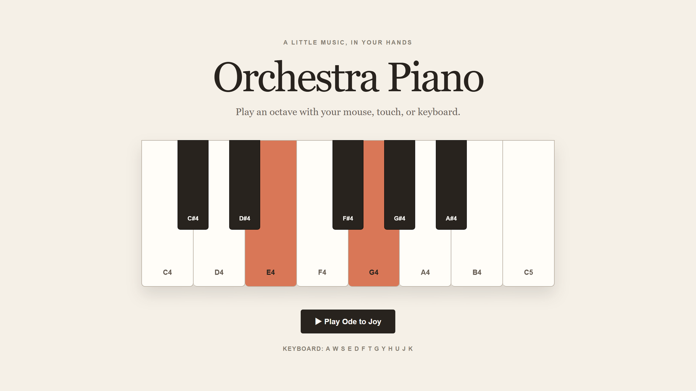
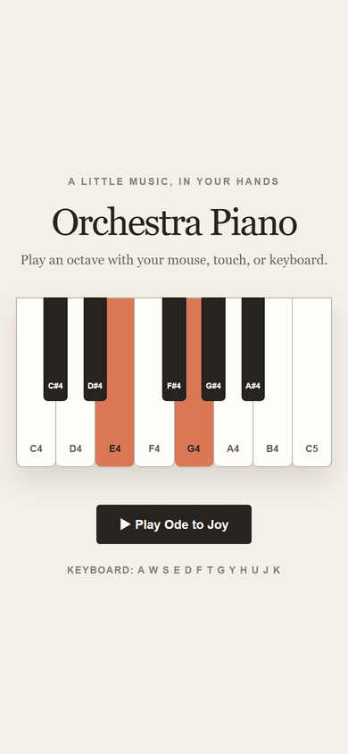

# 실제 실행 기록: Orchestra Piano

<p align="center"></p>

오케스트라 v0.2.0의 orchestrator 흐름(계획 → 난이도 표 → 라우팅 → 워커 배정 → 메인 세션 리뷰 → 수정 루프 → ledger)을
처음부터 끝까지 한 번 실제로 돌린 기록입니다. 편집하지 않은 실행 결과이며, 위 GIF도 헤드리스 Chrome에서 실제 재생 중에
찍은 화면을 캡처 시각 그대로 이은 것입니다.

| 항목 | 값 |
|---|---|
| 요청 | "간단하지만 시각적으로 확실한 작업" |
| 결과물 | [`examples/piano/`](../../../examples/piano/) — 한 옥타브 웹 피아노, *환희의 송가* 자동 연주와 건반 하이라이트 |
| 날짜·환경 | 2026-09-27, Windows 11, Claude Code 2.1.283 (메인 세션: Claude Opus 5.5), Codex CLI 0.156.1, Node.js 24 |
| 계획 | [`docs/superpowers/plans/2026-09-27-piano-demo-plan.md`](../../superpowers/plans/2026-09-27-piano-demo-plan.md) |
| ledger 원본 | [`ledger.md`](ledger.md) |

## 1. 난이도 표

| # | 작업 | 티어 | 파일 |
|---|---|---|---|
| 1 | 음 표와 멜로디 데이터 | Easy | `notes.js`, `notes.test.mjs` |
| 2 | 스케줄러와 Web Audio 플레이어 | Medium | `player.js`, `player.test.mjs` |
| 3 | 피아노 페이지 | Hard (UI) | `index.html`, `style.css`, `app.js` |

Task 1과 2는 파일이 겹치지 않아 병렬, Task 3은 두 작업이 끝난 뒤 실행했습니다.

## 2. 라우팅

라우팅 설정 파일이 없어서 오케스트레이터가 세 티어를 `AskUserQuestion`으로 물었고, 사용자가 모두 Codex를 골랐습니다.

```text
Routing: Easy=Codex gpt-6-luna/medium, Medium=Codex gpt-6-sol/medium, UI=Codex gpt-6-sol/high
```

## 3. 타임라인

| 시각 | 워커 (작업 목록 라벨) | 결과 |
|---|---|---|
| 23:24:07–23:25:21 | `[Codex gpt-6-luna/medium] Task 1` | DONE, 74초. `Scope: outside allowed: examples/piano/player.js` → 동시에 돌던 Task 2의 파일이라 규칙대로 무시 |
| 23:24:08–23:26:39 | `[Codex gpt-6-sol/medium] Task 2` | DONE, 151초. Scope에 Task 1 파일 → 무시. 리뷰에서 Important 1건 |
| 23:27:39–23:28:22 | `[Codex gpt-6-sol/medium] Task 2 fix 1` (`--resume`) | 43초, `Scope: ok`, 재리뷰 CLEAN |
| 23:27:40–23:32:51 | `[Codex gpt-6-sol/high] Task 3` | DONE, 311초. Scope에 Task 2 수정 파일 → 무시. 브라우저 리뷰에서 3건 |
| 23:34:23–23:37:35 | `[Codex gpt-6-sol/high] Task 3 fix 1` (`--resume`) | 192초, `Scope: ok`, 재리뷰 CLEAN |

워커 전체 경과 13분 28초. 병렬 실행 2번, 수정 라운드 2번(작업당 최대 1번). 떠 있는 프로세스는 없었습니다.

## 4. 메인 세션 리뷰가 잡은 것

워커는 모두 `Status: DONE`을 돌려줬지만, 메인 세션이 실제 diff와 브라우저를 보고 아래를 찾았습니다.

| # | 대상 | 발견 | 처리 |
|---|---|---|---|
| 1 | Task 2 | 테스트가 `data:` URL로 `player.js`를 불러오는 우회를 씀. 근본 원인은 계획 누락: `package.json`의 `"type": "module"`이 없어 Node 18/20에서 `.js`가 CommonJS로 읽힘(Task 1 테스트도 같은 문제) | `Ruling:` 메인 세션이 4줄짜리 `package.json`을 추가하고, 워커에게 일반 import로 되돌리게 함 |
| 2 | 계획 | 검증 명령 `node --test examples/piano/`가 폴더를 파일로 실행해 실패 | `Ruling:` `node --test "examples/piano/*.test.mjs"`로 수정 |
| 3 | Task 3 | 흰 건반 사이 테두리가 C–D, D–E, F–G, G–A, A–B에서만 2줄 (DOM에서 검은 건반이 사이에 있어 `+` 선택자가 안 맞음) | 수정 라운드 → 모든 경계 1px |
| 4 | Task 3 | 매 로드마다 `favicon.ico` 404 콘솔 오류 | 수정 라운드 → 콘솔 오류 0 |
| 5 | Task 3 | 같은 음 반복(E4 E4, G4 G4, C4 C4)에서 건반이 계속 켜져 있어 두 번째 타건이 안 보임 | 수정 라운드 → 타건마다 짧은 strike 애니메이션 |

보류한 Minor 1건: 이웃한 두 음의 끝/시작 타이머가 같은 부동소수 합에 의존함(120 bpm에서는 정확히 일치).

## 5. 검증 증거

- `node --test "examples/piano/*.test.mjs"` → 7개 통과 (음 데이터·멜로디 16박·스케줄 계산·오류 처리·가짜 AudioContext로 주파수와 `onNote` 순서).
- 저장소 테스트 5개 파일 통과, 실행 후 떠 있는 워커 프로세스 없음.
- 헤드리스 Chrome(DevTools 프로토콜, `python -m http.server`로 서빙):

| 확인 | 결과 |
|---|---|
| 건반 수 | 13개 (흰 8, 검은 5) |
| `?pressed=E4,G4` | E4, G4 켜짐 |
| C5 클릭 / 키보드 `d` | C5 / E4 켜짐 |
| 재생 중 하이라이트 순서 | E E F G G F E D C … (0.25초 간격 샘플) |
| 타건 애니메이션 | 15회, 멜로디 순서 그대로 (반복 음 포함) |
| 재생 버튼 | 재생 중 비활성, 끝나면 다시 활성 |
| 가로 스크롤 | 1280, 390, 360px 모두 없음 |
| 콘솔 오류 | 0 |

<p>
  
  
</p>

## 6. Codex 사용량

Codex 세션 기록(`~/.codex/sessions/.../rollout-*.jsonl`)의 마지막 `token_count` 기준입니다.

| 작업 | 모델/effort | 턴 | 입력 (캐시 적중) | 출력 (추론) |
|---|---|---|---|---|
| Task 1 | gpt-6-luna/medium | 1 | 212,088 (193,280) | 2,064 (200) |
| Task 2 | gpt-6-sol/medium | 2 | 606,384 (576,384) | 6,456 (1,681) |
| Task 3 | gpt-6-sol/high | 2 | 1,197,884 (1,140,864) | 18,093 (8,424) |

입력의 91–95%가 캐시 적중이었습니다. 메인 세션(Claude)의 사용량은 따로 재지 않았고, 한도 절감률로 환산하지 않습니다.

## 7. 이 기록의 한계

- 사용자가 세 티어를 모두 Codex로 골라서 **Claude 워커 경로(`orchestra:implementer`)는 이 실행에 없습니다.** 같은 계획을 Claude 워커로 돌린 결과는 [비교 기록](comparison.md)에 있습니다.
- 소리는 사람이 직접 듣고 확인하지 않았습니다. 오실레이터 호출과 타이밍은 테스트로, 하이라이트는 브라우저로 확인했습니다.
- 이 세션에 설치된 플러그인은 0.1.0이었기 때문에, 메인 세션은 저장소의 v0.2.0 `skills/orchestrator/SKILL.md`와
  `codex-worker.mjs`를 직접 따랐습니다.
