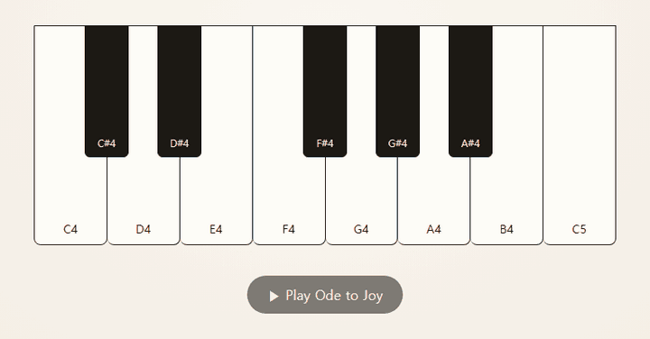

# 같은 작업, 두 가지 라우팅: Codex 워커 vs Claude 워커

[Orchestra Piano](README.md)를 같은 계획, 같은 시작 커밋(`910ae7e`), 같은 작업 브리프로 두 번 만들었습니다.
메인 세션(Claude Opus 5.5)이 계획·리뷰·검증을 맡은 것은 두 실행이 같고, **구현 워커만 다릅니다.**

| | 실행 A: Codex 워커 | 실행 B: Claude 워커 |
|---|---|---|
| 라우팅 | Easy=`gpt-6-luna/medium`, Medium=`gpt-6-sol/medium`, UI=`gpt-6-sol/high` | Easy=`sonnet/medium`, Medium=`sonnet/high`, UI=`opus/high` |
| 결과 |  |  |
| 기록 | [실행 A](README.md), [ledger](ledger.md) | [ledger](claude-run/ledger.md), [소스](claude-run/src/) |

두 결과물 모두 마지막에는 같은 브라우저 검증을 통과했습니다. 확인한 항목은 건반 13개, 클릭·키보드 연주, 재생 순서대로 켜지는
하이라이트, 반복 음 타건 15회, 360·390·1280px에서 가로 스크롤 없음, 콘솔 오류 0입니다.

## 1. 시간과 수정 라운드

| 작업 | A: 워커 | A: 시간 | A: 수정 | B: 워커 | B: 시간 | B: 수정 |
|---|---|---|---|---|---|---|
| 1. 음 데이터 | Codex luna/medium | 74초 | 0 | Claude sonnet/medium | 94초 | 0 |
| 2. 오디오 재생 | Codex sol/medium | 151 + 43초 | 1 | Claude sonnet/high | 287초 | 0 |
| 3. 피아노 화면 | Codex sol/high | 311 + 192초 | 1 | Claude opus/high | 217 + 79초 | 1 |
| **합계** | | **771초** | **2** | | **677초** | **1** |
| 시작 → 끝 (병렬 포함) | | **13분 28초** | | | **12분 26초** | |

## 2. 메인 세션 리뷰가 잡은 것

| 발견 | A | B |
|---|---|---|
| 계획 누락: `package.json`이 없어 Node 18/20에서 테스트가 깨짐 | 있음 (Task 2 워커가 `data:` URL로 우회 → 수정 라운드) | 있음 (워커는 모르고 지나감, 같은 `Ruling:` 적용) |
| 계획의 검증 명령 `node --test examples/piano/` 오류 | 메인 세션 발견 | 워커 두 명이 먼저 보고 |
| 흰 건반 테두리 두 줄 | 있음 | 없음 |
| `favicon.ico` 404 콘솔 오류 | 있음 | 없음 (처음부터 처리) |
| 반복 음 두 번째 타건이 안 보임 | 있음 | 있음 |
| 허용 목록 밖 파일 | 없음 (`Scope`의 표시는 병렬 워커 파일뿐) | Minor: 저장소 밖 scratchpad에 확인용 스크립트 1개 |

같은 브리프에서 Claude 워커(B)는 화면 세부를 처음부터 더 많이 맞췄고, 같은 건반을 겹쳐 누를 때 하이라이트가 일찍
꺼지지 않도록 카운터도 넣었습니다. 반면 Node 18/20 문제는 Codex 워커(A)만 알아챘습니다(우회는 잘못된 방향이었지만 신호는 됐습니다).

## 3. 사용량

두 엔진이 사용량을 기록하는 방식이 달라서, 같은 단위로 바꿀 수 있는 항목만 나란히 적습니다.

| | A: Codex 워커 합계 | B: Claude 워커 합계 |
|---|---|---|
| 입력 토큰 | 2,016,356 | 2,682,343 |
| └ 캐시에서 읽음 | 1,910,528 (94.8%) | 2,498,011 (93.1%) |
| └ 캐시에 새로 씀 | (Codex는 따로 표시 안 함) | 184,236 |
| 출력 토큰 | 26,613 (추론 10,305 포함) | 약 13,900 이상 (보이는 출력만 추정, 아래 참고) |
| 요금제 한도에 미친 영향 | Codex 7일 한도 **9% → 9%** (1% 미만) | Claude 한도에서 차감 (%는 측정 불가, 아래 참고) |
| Claude 한도 사용 | **워커 0** | 워커 입력 약 268만 토큰 |

- **A (Codex):** `~/.codex/sessions`의 세션 기록 마지막 `token_count` 값입니다. 7일 한도 사용률도 같은 기록의 `rate_limits`에서
  읽었습니다(정수 %라서 1% 미만의 변화는 보이지 않습니다).
- **B (Claude):** 서브에이전트 기록(`~/.claude/projects/.../subagents/*.jsonl`)의 `usage`를 합했습니다. 이 기록은 출력 토큰을
  스트림 시작 시점 값(1–4)으로만 남기기 때문에, 출력은 생성된 텍스트·도구 입력 길이를 4자당 1토큰으로 나눠 **하한만** 추정했습니다.
  숨겨진 추론(thinking)은 빠져 있습니다.
- Claude 한도 사용률(%)은 Claude Code가 상태줄 스크립트에만 넘겨주는 값이라 이 실험에서 직접 읽지 못했습니다.
- **메인 세션 사용량은 두 실행 모두 재지 않았습니다.** 계획·리뷰·브라우저 검증은 양쪽이 같은 방식이지만, 메인 세션 대화가 매우 길어
  공정한 분리가 어렵습니다.

## 4. 결론

- **품질과 속도는 비슷했습니다.** 마지막 결과물은 같은 검증을 모두 통과했고, 경과 시간은 약 1분 차이였습니다.
- **Claude 워커는 이번 UI 작업에서 처음 결과가 더 좋았습니다.** 수정 라운드가 A는 2번, B는 1번이었습니다.
- **Codex 워커의 이점은 한도 분산입니다.** 같은 구현량을 Codex로 돌리면 Claude 한도에서는 워커 사용량이 0이고,
  Codex 쪽은 7일 한도의 1% 미만만 썼습니다. 두 구독을 함께 쓰는 사람에게 오케스트라가 노리는 효과가 바로 이것입니다.
- **아직 일반화할 수 없습니다.** 각 방식 1회씩, 작은 작업 하나의 결과입니다.

## 5. 공정성과 한계

- 같은 계획, 같은 시작 커밋, 같은 작업 브리프(`task-brief` 출력이 줄바꿈 외에는 동일), 같은 검증 스크립트를 썼습니다.
- Claude 워커 프롬프트에는 Codex 전용 규칙(git 금지 등 4줄)을 붙이지 않았습니다. Claude 구현자 에이전트 정의에 같은 규칙이 이미 있습니다.
- 메인 세션은 B를 리뷰할 때 A의 발견 사항을 이미 알고 있었습니다. 같은 점검 목록을 적용했지만, 리뷰 기준이 완전히 눈가림된 것은 아닙니다.
- `package.json` 누락에 대한 `Ruling:`은 두 실행 모두 Task 2 리뷰 직후, Task 3 배정 전에 적용했습니다.
- 소리는 사람이 직접 듣지 않았습니다. 오디오 호출과 타이밍은 테스트로, 하이라이트는 브라우저로 확인했습니다.
