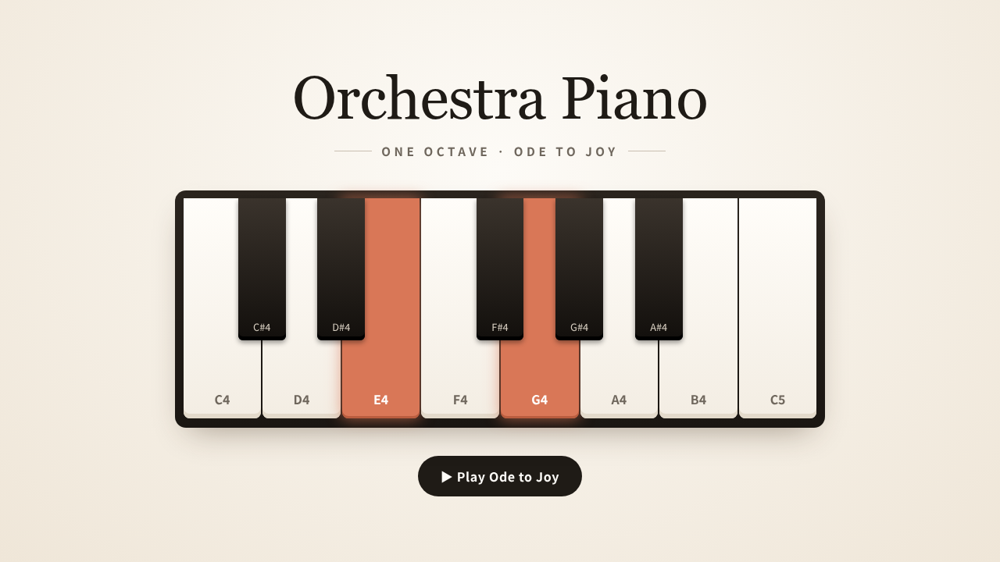
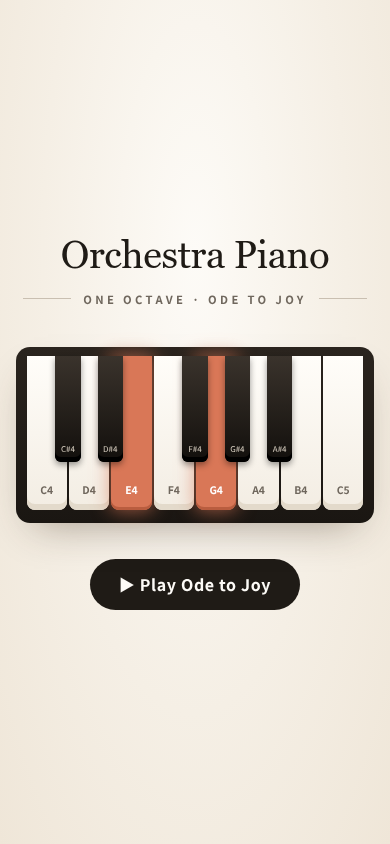

# 실행 C: Linux에서 Orchestra 0.4.0으로 다시

<p align="center"></p>

실행 A·B와 같은 계획, 같은 시작 커밋(`910ae7e`), 실행 B와 같은 라우팅으로 Linux에서 한 번 더 돌린 기록입니다.
이번에는 설치된 Orchestra 0.4.0을 새 헤드리스 세션(`claude -p`)에 로드했고, 메인 세션은 A·B의 발견 사항을 모르는
상태에서 시작했습니다. 실행 결과는 편집하지 않았고, 끝난 뒤 별도 세션에서 독립 검증을 했습니다.

| 항목 | 값 |
|---|---|
| 날짜·환경 | 2026-09-29, Ubuntu 22.04.5 (커널 6.8), Claude Code 2.1.284 (메인 세션: Claude Opus 5.5, effort high, `--permission-mode auto`), Node.js 22.22.2, Python 3.10.12, Google Chrome 146 |
| 플러그인 | Orchestra 0.4.0 (`8e6537d`). 사용자 전역 훅(caveman, ponytail, context-mode, RTK)이 켜진 실제 환경 |
| 계획 | [`docs/orchestra/plans/2026-09-27-piano-demo-plan.md`](../../../orchestra/plans/2026-09-27-piano-demo-plan.md) |
| ledger 원본 | [`ledger.md`](ledger.md) |
| 결과물 | [`src/`](src/) (워커가 만든 그대로. 커밋하지 않은 작업 트리에서 복사) |
| 독립 검증 스크립트 | [`check.mjs`](check.mjs) |

헤드리스 세션에 준 요청 전문입니다. 라우팅은 프로젝트 `.orchestra.json`으로 고정했습니다.

```text
Execute the approved plan docs/superpowers/plans/2026-09-27-piano-demo-plan.md with orchestra:orchestrator.

This is run C of the recorded piano demo: the same plan and start commit (910ae7e) as runs A and B, now on Linux
with Orchestra 0.4.0. Routing is in .orchestra.json; do not ask about it.

You are running headless and nobody can answer questions. Where the plan leaves a consequential gap, choose the
conservative fix inside the plan's non-goals and record it as a `Ruling:` in the ledger. Record each worker's start
and end time in the ledger. Do not commit, push, or change branches; leave all changes in the working tree.

Environment: Ubuntu Linux, Node 22, Python 3.10, google-chrome for the headless browser checks (serve examples/piano
with python3 -m http.server). Stop any server or browser you start.

When done, print the ledger path and a short summary: per-task worker, wall time, fix rounds, review findings, and
verification evidence.
```

## 1. 라우팅

```text
Routing: Easy=claude sonnet/medium, Medium=claude sonnet/high, Hard=claude opus/high, UI=claude opus/high
```

모든 티어에 값이 있어서 질문 없이 진행했습니다. 이날 별칭은 `sonnet` = `claude-sonnet-5-5`, `opus` = `claude-opus-5-5`로
풀렸습니다. 실행 B 때 `sonnet`은 Sonnet 5였습니다(당시 README 기준).

## 2. 타임라인

시각은 세션 전사 기록 기준(+09:00)입니다. ledger의 시각은 메인 세션이 배정 호출을 쓰기 전에 찍은 값이라 약 40초
이르고, 소요 시간은 같습니다.

| 시각 | 워커 (작업 목록 라벨) | 결과 |
|---|---|---|
| 13:21:04 | 메인 세션 시작 | orchestrator 로드, 작업 표와 브리프 작성 |
| 13:23:34–13:23:52 | `[Claude sonnet/medium] Task 1` (`implementer-medium`) | DONE, 18.3초, 도구 4회. 리뷰 clean |
| 13:23:34–13:24:25 | `[Claude sonnet/high] Task 2` (`implementer`), Task 1과 병렬 | DONE, 51.5초, 도구 5회. 리뷰 clean |
| 13:25:43–13:30:36 | `[Claude opus/high] Task 3` (`implementer`, model opus) | DONE, 292.9초, 도구 25회. 360px 가로 넘침을 워커가 스스로 찾아 수정. 리뷰 clean |
| 13:31:32–13:32:33 | 메인 세션 최종 검증 | 테스트 9개 통과, 헤드리스 Chrome 검사 통과, 스크린샷 2장 |
| 13:33:49 | 종료 | 남은 서버·브라우저 없음 |

워커 시간 합계 363초, 첫 워커 시작부터 마지막 워커 끝까지 7분 2초, 세션 전체 12분 46초. 수정 라운드 0번.

## 3. 메인 세션 리뷰

Critical·Important는 0건이고, Minor 8건은 미뤘습니다. 그중 화면에 관한 것은 아래와 같습니다.

- 켜진 건반의 흰 글자 대비가 약 3.1:1 (작은 글자 기준 4.5:1 미만)
- 390px에서 검은 건반 글자 약 8px
- `?pressed`로 켠 건반은 그 음을 치면 꺼짐
- 같은 음 반복(E4 E4)은 끄고 켜는 타이머가 연달아 실행돼 계속 켜진 것처럼 보일 수 있음

`Ruling:`은 6건입니다.
- Codex 실행이 없으므로 검증 3(`Scope: ok`)은 해당 없음. 대신 `git status`로 작업별 파일만 바뀌었는지 확인
- 계획의 검증 단계가 `docs/demo/` 스크린샷을 요구하므로, 이 두 파일만 `examples/piano/` 밖 예외로 둠
- `node --test examples/piano/`는 폴더를 파일로 읽어 실패하므로 `node --test examples/piano/*.test.mjs`로 바꿈
- 불빛을 소리에 맞추려고 `onNote`에 0.05초 선행을 넣고, 앞 음의 끝이 다음 음의 시작보다 먼저 오게 고정
- `AudioContext`는 첫 사용자 동작에 하나 만들어 계속 재사용
- Ubuntu에는 `python`이 없어 `python3` 사용

정리 문제 2건은 세션이 스스로 해결했습니다. 워커의 RED 실행이 메인 세션의 검사 스크립트를 중간에 죽여 Chrome이 남았고,
워커가 이를 종료했습니다. 메인 세션의 첫 최종 실행은 `http.server`와 Chrome 프로필 폴더를 남겼고, 정리한 뒤 스크립트를
고쳐 다시 돌렸습니다.

## 4. 독립 검증

실행이 끝난 뒤 별도 세션에서 [`check.mjs`](check.mjs)로 A·B와 같은 항목을 쟀고, 같은 스크립트로 A·B의 최종 결과물도 함께
쟀습니다.

| 확인 | 실행 C | A·B 최종 결과물 |
|---|---|---|
| `node --test` (Node 22) | 9개 통과 | 7개, 8개 통과 |
| Node 18과 같은 조건 (`node --no-experimental-detect-module --test`) | **실패**: `.js`가 CommonJS로 읽혀 `Named export 'NOTES' not found` | 통과 (`package.json`의 `"type": "module"`) |
| 건반 | 13개 (흰 8) | 같음 |
| `?pressed=E4,G4` | E4, G4 켜짐 | 같음 |
| C5 클릭 / 키보드 `d` | C5 / E4 켜짐 | 같음 |
| 재생 버튼 | 재생 중 비활성, 끝나면 다시 활성 | 같음 |
| 가로 스크롤 (1280·390·360px) | 없음 | 같음 |
| 콘솔 오류 | 0 | 0 |
| 반복 음 두 번째 타건 | **안 보임**: 타건 애니메이션 0회, 같은 음 5쌍 모두 꺼진 프레임 0 | 보임: 타건 애니메이션 15회 |

실행의 리뷰가 놓치거나 낮게 본 것은 두 가지입니다.

1. **계획의 Node 18 조건을 못 맞춤.** 계획은 "Node.js 18+ `node --test`"를 요구하지만 `package.json`이 없어서 Node 18에서는
   테스트가 깨집니다. Node 22는 ESM 문법을 자동으로 감지하므로 이 머신에서는 드러나지 않았습니다. A·B는 같은 계획 누락을
   `Ruling:`으로 해결했습니다.
2. **반복 음.** 메인 세션도 같은 현상을 봤지만 Minor로 미뤘습니다. A·B는 Important로 보고 수정 라운드에서 고쳤습니다.
   계획 문구("소리 나는 동안 `is-active`")만 보면 C도 틀리지 않았습니다.

<p>
  
  
</p>

## 5. 사용량

입력 토큰은 서브에이전트 전사 기록(실행 B와 같은 방식)으로 셌고, 결과 이벤트의 모델별 합계와 정확히 일치했습니다.
출력 토큰은 결과 이벤트의 모델별 값만 믿을 수 있습니다. 전사 기록은 출력을 스트림 시작 시점 값으로만 남깁니다.

| | 입력 (캐시 읽음) | 캐시에 새로 씀 | 출력 |
|---|---|---|---|
| Task 1 워커 (Sonnet 5.5) | 95,255 (69,741) | 25,506 | Task 1·2 합계 8,477 |
| Task 2 워커 (Sonnet 5.5) | 163,339 (132,889) | 30,438 | (위와 합산) |
| Task 3 워커 (Opus 5.5) | 894,715 (836,480) | 58,193 | 메인 세션과 합산 |
| **워커 합계** | **1,153,309 (90.1%)** | 114,137 | |
| 메인 세션 (Opus 5.5) | 3,125,852 (3,019,519) | 106,253 | Opus 합계 57,167 (메인 + Task 3) |

- 실행 B의 워커 입력은 2,682,343이었습니다. C는 그 43%인데, 수정 라운드가 없었고 모델도 달라 원인을 하나로 볼 수 없습니다.
- 세션 전체를 API 요금으로 환산하면 $3.32입니다(`total_cost_usd`). 구독 한도 사용률은 이 방법으로 읽을 수 없습니다.

## 6. 이 기록의 한계

- 1회 실행입니다. A·B와 OS, 플러그인 버전, 모델 별칭 해석, Node 버전, 메인 세션 방식(헤드리스)이 모두 달라 차이의 원인을
  하나로 돌릴 수 없습니다.
- 헤드리스라 사용자 개입이 없었습니다. 판단이 필요한 곳은 메인 세션이 `Ruling:`으로 정했습니다.
- 사용자 전역 훅이 켜진 환경이라 출력 문체나 명령 출력 요약에 영향이 있었을 수 있습니다.
- 소리는 사람이 직접 듣지 않았습니다.
- 저장소의 [`examples/piano/`](../../../../examples/piano/)는 실행 A의 결과 그대로입니다.
